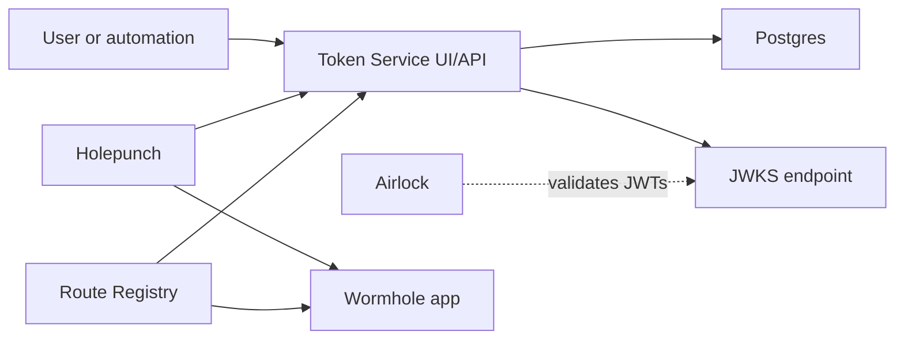

# Token Service

Token Service is the Wormhole authority for creating, validating, rotating, and
exchanging Wormhole access tokens.

## Table of Contents

- [Description](#description)
- [How Token Service Fits Into Wormhole](#how-token-service-fits-into-wormhole)
- [Configuration](#configuration)
- [Deployment](#deployment)
- [Development](#development)
- [API and Token Notes](#api-and-token-notes)
- [User Syncing Bootstrap](#user-syncing-bootstrap)
- [Testing](#testing)
- [Developer Notes](#developer-notes)
- [Governance](#governance)

## Description

Token Service is a Python FastAPI service that manages Wormhole access tokens.
It creates and stores user/admin tokens, validates `X-Token` credentials,
exchanges valid tokens or MFA/OIDC sessions for short-lived JWTs, publishes
JWKS for downstream validation, and exposes internal admin APIs for identity
sync and impersonated token creation. Major dependencies include FastAPI,
fastapi-offline, SQLAlchemy, Alembic, Dynaconf, Authlib, bcrypt, Pendulum,
psycopg2, attrs, tenacity, requests, and multimethod. The bundled UI is built
with Node 18 or newer, Mithril, Tailwind, and Webpack.

The service uses a layered architecture. `token_service/command.py` provides
the CLI entry point for `run`, `openapi`, and `generate-jwks`;
`token_service/server.py` assembles FastAPI routes and versioned API aliases;
`token_service/routers` contains public token, MFA, and well-known JWKS
endpoints; `token_service/internal` contains admin routes for users, groups, and
tokens; `token_service/models.py` contains attrs domain models;
`token_service/pydantic_models.py` defines API schemas; `token_service/store`
and `token_service/service/uow.py` implement SQLAlchemy repositories and unit
of work; and `token_service/services.py` implements token lifecycle logic.

Within Wormhole, Token Service is the identity and token authority. Holepunch
uses it to exchange Wormhole access tokens and OAuth sessions for short-lived
JWTs; Route Registry uses it to authenticate callers and validate JWTs; Airlock
uses its JWKS endpoint to validate tokens before forwarding requests to local
apps; and users or automation acquire tokens to access Wormhole-protected apps
without managing a separate credential per service.

## How Token Service Fits Into Wormhole



The service connects enterprise authentication to Wormhole tokens and JWTs so
interactive browser access and automated API access use the same access-control
foundation.

## Configuration

Token Service uses Dynaconf. Defaults live in
`token_service/config/settings.toml`; local overrides can be supplied with
`settings.toml`, `settings.local.toml`, `.secrets.toml`, or `DYNACONF_*`
environment variables.

Important configuration groups include:

| Group | Purpose |
| --- | --- |
| `SERVER` | FastAPI host and port. |
| `DB` | SQLAlchemy database URL and credentials. |
| `AUTH.authlib_oidc` | OIDC provider, session cookie, redirect, and discovery settings. |
| `AUTH.jwt` | JWT algorithm, signing keys, and key ID. |
| `AUTH.admin` | Admin API secret material. |
| `TOKEN` | Session name, session lifetime, and maximum token lifetime. |

Generate JWKS material per environment:

```shell
uv run token_service generate-jwks --write-settings --overwrite
```

This creates `jwks/private.pem`, `jwks/public.pem`, `jwks/kid.txt`, and a local
settings override when requested. Treat generated private keys as secrets.

## Deployment

### OpenShift and Helm

The Helm chart in `helm/token-service` deploys the app, services,
ingress, service account, and config map. The app deployment
loads non-secret Dynaconf settings from `token-service-config`, loads secret
settings from `token-service-secrets`, and runs `/app/scripts/migrate-db` in an
init container before the API starts.

Create the required secrets before deploying.

#### 1. Initialize PostgreSQL

Connect to PostgreSQL with `psql` and create the database, user, and schema:

```sql
CREATE DATABASE "tokenServiceDB";
CREATE USER "tokenServiceUser" WITH PASSWORD 'yourStrongPassword';
\c tokenServiceDB
CREATE SCHEMA "tokenServiceUser" AUTHORIZATION "tokenServiceUser";
```

Validate the connection:

```shell
psql -U tokenServiceUser -d tokenServiceDB -h localhost -p 5432
```

#### 2. Create `token-service-secrets`

Required keys:

- `DYNACONF_AUTH__admin__secret_key`: randomly generated admin secret.
- `DYNACONF_AUTH__authlib_oidc__client_id`: client ID registered with the OAuth provider.
- `DYNACONF_AUTH__authlib_oidc__client_secret`: client secret from the OAuth provider.
- `DYNACONF_AUTH__authlib_oidc__session_config__secret_key`: randomly generated session secret.
- `DYNACONF_AUTH__jwt__private_pem`: JWT private PEM generated by `token_service generate-jwks`.
- `DYNACONF_AUTH__jwt__public_pem`: JWT public PEM generated by `token_service generate-jwks`.
- `DYNACONF_DB__username`: postgres username.
- `DYNACONF_DB__password`: postgres password.
- `DYNACONF_DB__url`: postgres connection string.

#### 3. Deploy Token Service

Deploy with the Helm values for the target environment:

```shell
helm upgrade --install token-service ./helm/token-service -f ./helm/token-service/values.yaml
```

Use the appropriate overlay and namespace for the target deployment.

CI builds the UI, publishes OpenAPI, publishes the Python package and container
image, copies images into OpenShift, and deploys with Helm.

## Development

Requirements:

- Python 3.11 or newer
- [uv](https://docs.astral.sh/uv/)
- Node 18 or newer for the UI
- Postgres for migration work

Install locally:

```shell
uv venv
uv pip install -e .
```

Pre-Commit Hook:

```shell
uvx pre-commit install
```

This runs basic `lint` checks on the repository. We highly encourage using this
`hook` to avoid unnecessary `lint` CI failures.

Generate local JWKS/settings:

```shell
uv run wormhole_token_service generate-jwks --write-settings --overwrite
```

Run the API:

```shell
uv run wormhole_token_service run --host localhost --port 5000
```

Run migrations:

```shell
uv run alembic upgrade head
```

Generate OpenAPI:

```shell
uv run wormhole_token_service openapi
```

Build the UI:

```shell
cd token_service/ui
npm ci
npm run build
```

The UI build is bundled into `token_service/ui/dist`.

## API and Token Notes

Important public endpoints include:

| Endpoint | Purpose |
| --- | --- |
| `/.well-known/jwks.json` | Publishes public keys used to validate JWTs. |
| `/api/v1/token/jwt` | Exchanges a valid Wormhole access token for a short-lived JWT. |
| `/api/v1/mfa/jwt` | Exchanges a valid OIDC/MFA session for a short-lived JWT. |
| `/api/v1/token/rotate` | Rotates eligible tokens after attestation. |

Important internal/admin endpoints include user, group, and admin token
management routes under `/api/v1/admin`. Admin token creation is implemented at:

```text
/api/v1/admin/token
```

Token strings are represented as `id.secret`. Normal token secrets are stored as
bcrypt hashes. Subtokens are delegated child credentials that inherit parent
token lifetime constraints. JWT claims include user, group, scope, DUID,
parent-token, external ID, and token ID context used by downstream Wormhole
components.

## User Syncing Bootstrap

If you have an identity syncing service, it needs an admin token so it can
populate Token Service identity tables.

Use this bootstrap flow for a new environment.

### 1. Add a temporary admin user

```sql
INSERT INTO "tokenServiceUser"."user" (uid, is_admin, duid)
VALUES ('<your user>', TRUE, 1);
```

### 2. Authenticate to Token Service

Open this URL in a browser and complete authentication:

```text
https://<token-service>/api/v1/mfa/jwt
```

Use browser developer tools to find the `token-service-session` cookie.

### 3. Create the Sync admin token

```shell
curl -H "Cookie: token-service-session={cookie}" \
  -X POST \
  -H "Content-Type: application/json" \
  -d '{"name": "sync", "role": "IDENTITY"}' \
  https://<token-service>/api/v1/admin/token
```

### 4. Store Secret

Store the secret where your user syncing service expects it.

### 5. Remove the temporary admin user

```sql
DELETE FROM "tokenServiceUser"."user" WHERE uid = '<your user>';
```

### 6. Verify cron behavior

When a new sync job starts, it should populate the user table in the
Token Service database.

## Testing

Run lint checks:

```shell
uvx tox -e lint
```

Run the Python test suite used by CI:

```shell
uvx tox -e py311
```

Run non-integration tests directly:

```shell
uv run pytest -m "not integration"
```

Tox runs Ruff checks and format checks for `token_service` and `tests`.

## Developer Notes

- `token_service/server.py` mounts versioned aliases under `/api/v1`,
  `/api/latest`, and `/api/stable`.
- `token_service/dependencies.py` owns auth dependency wiring for OIDC sessions,
  admin tokens, user tokens, and impersonation flows.
- `token_service/services.py` owns token creation, validation, JWT issuance,
  attestation, and rotation logic.
- `token_service/store/orm.py` contains SQLAlchemy table mappings; keep Alembic
  migrations in sync with model changes.
- E2E tests start a real Uvicorn server with fake OIDC dependencies.

## Governance

Contributions are welcome. Contributors should look in `CONTRIBUTING.md` for
project guidelines on how to create and structure pull requests.

This project is licensed under the Apache 2.0 license with LLVM exception. The
full license text is available in `LICENSE`.

LLNL-CODE-2020712
